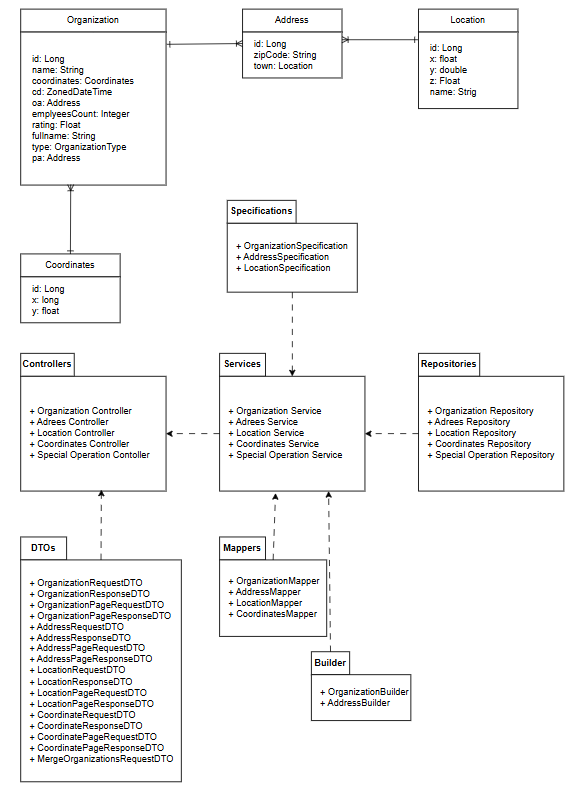

# Лабораторная работа по информационным системам (backend)

## Задание

Реализовать информационную систему, которая позволяет взаимодействовать с объектами класса Organization, описание которого приведено ниже:

public class Organization {\
private long id; //Значение поля должно быть больше 0, Значение этого поля должно быть уникальным, Значение этого поля должно генерироваться автоматически\
private String name; //Поле не может быть null, Строка не может быть пустой\
private Coordinates coordinates; //Поле не может быть null\
private java.time.ZonedDateTime creationDate; //Поле не может быть null, Значение этого поля должно генерироваться автоматически\
private Address officialAddress; //Поле не может быть null\
private Double annualTurnover; //Поле не может быть null, Значение поля должно быть больше 0\
private Integer employeesCount; //Поле может быть null, Значение поля должно быть больше 0\
private Float rating; //Поле может быть null, Значение поля должно быть больше 0\
private String fullName; //Строка не может быть пустой, Поле не может быть null\
private OrganizationType type; //Поле не может быть null\
private Address postalAddress; //Поле не может быть null\
}

public class Coordinates {\
private long x;\
private float y;\
}

public class Address {\
private String zipCode; //Поле может быть null\
private Location town; //Поле может быть null\
}

public class Location {\
private float x;\
private double y;\
private Float z; //Поле не может быть null\
private String name; //Поле может быть null\
}

public enum OrganizationType {\
GOVERNMENT,\
TRUST,\
PRIVATE_LIMITED_COMPANY;\
}

Разработанная система должна удовлетворять следующим требованиям:

- Основное назначение информационной системы - управление объектами, созданными на основе заданного в варианте класса.
- Необходимо, чтобы с помощью системы можно было выполнить следующие операции с объектами: создание нового объекта, получение информации об объекте по ИД, обновление объекта (модификация его атрибутов), удаление объекта. Операции должны осуществляться в отдельных окнах (интерфейсах) приложения.При получении информации об объекте класса должна также выводиться информация о связанных с ним объектах.
- При создании объекта класса необходимо дать пользователю возможность связать новый объект с объектами вспомогательных классов, которые могут быть связаны с созданным объектом и уже есть в системе.
- Выполнение операций по управлению объектами должно осуществляться на серверной части (не на клиенте), изменения должны синхронизироваться с базой данных.
- На главном экране системы должен выводиться список текущих объетов в виде таблицы (каждый атрибут объекта - отдельная колонка в таблице). При отображении таблицы должна использоваться пагинация (если все объекты не помещаются на одном экране).
- Нужно обеспечить возможность фильтровать/сортировать строки таблицы, которые показывают объекты (по значениям любой из строковых колонок). Фильтрация элементов должна производиться только по полному совпадению.
- Переход к обновлению (модификации) объекта должен быть возможен из таблицы с общим списком объектов и из области с визуализацией объекта (при ее реализации).
- При добавлении/удалении/изменении объекта, он должен автоматически появиться/исчезнуть/измениться в интерфейсах у других пользователей, авторизованных в системе.
- Если при удалении объекта с ним связан другой объект, связанные объекты должны быть связаны с другим объектом (по выбору пользователя), а изначальный объект удален.
- Пользователи должны иметь возможность просмотра всех объектов. Для модификации объекта должно открываться отдельное диалоговое окно. При вводе некорректных значений в поля объекта должны появляться информативные сообщения о соответствующих ошибках.

В системе должен быть реализован отдельный пользовательский интерфейс для выполнения специальных операций над объектами:

- Вернуть один (любой) объект, значение поля officialAddress которого является максимальным.
- Сгруппировать объекты по значению поля fullName, вернуть количество элементов в каждой группе.
- Вернуть массив объектов, значение поля fullName которых содержит заданную подстроку.
- Объединить организации, создав новую и зачислив в неё всех сотрудников двух исходных. Пользователь должен указать исходные организации, имя и адрес новой организации.
- Добавить нового сотрудника в организацию с указанным id.

Представленные операции должны быть реализованы в рамках компонентов бизнес-логики приложения без прямого использования функций и процедур БД.

Особенности хранения объектов, которые должны быть реализованы в системе:

- Организовать хранение данных об объектах в реляционной СУБД (PostgreSQL). Каждый объект, с которым работает ИС, должен быть сохранен в базе данных.
- Все требования к полям класса (указанные в виде комментариев к описанию классов) должны быть выполнены на уровне ORM и БД.
- Для генерации поля id использовать средства базы данных.
- Для подключения к БД на кафедральном сервере использовать хост pg, имя базы данных - studs, имя пользователя/пароль совпадают с таковыми для подключения к серверу.

При создании системы нужно учитывать следующие особенности организации взаимодействия с пользователем:

- Система должна реагировать на некорректный пользовательский ввод, ограничивая ввод недопустимых значений и информируя пользователей о причине ошибки.
- Переходы между различными логически обособленными частями системы должны осуществляться с помощью меню.
- При добавлении/удалении/изменении объекта, он должен автоматически появиться/исчезнуть/измениться на области у всех других клиентов.

При разработке ИС должны учитываться следующие требования:

- В качестве основы для реализации ИС необходимо использовать Spring MVC.
- Для создания уровня хранения необходимо использовать Hibernate.
- Разные уровни приложения должны быть отделены друг от друга, разные логические части ИС должны находиться в отдельных компонентах.

## Диаграммы



## Запуск и управление проектом

### Запуск приложения
```bash
mvn spring-boot:run
```
### Форматирование кода
```bash
mvn spotless:apply
```

### Проверка стиля кода
```bash
mvn spotless:check
```

### Проверка code style
```bash
mvn checkstyle:checkstyle
```

### Запуск приложения
```bash
gradle bootRun
```
### Форматирование кода
```bash
gradle codeFormat
```

### Проверка стиля кода
```bash
gradle codeFormatCheck
```